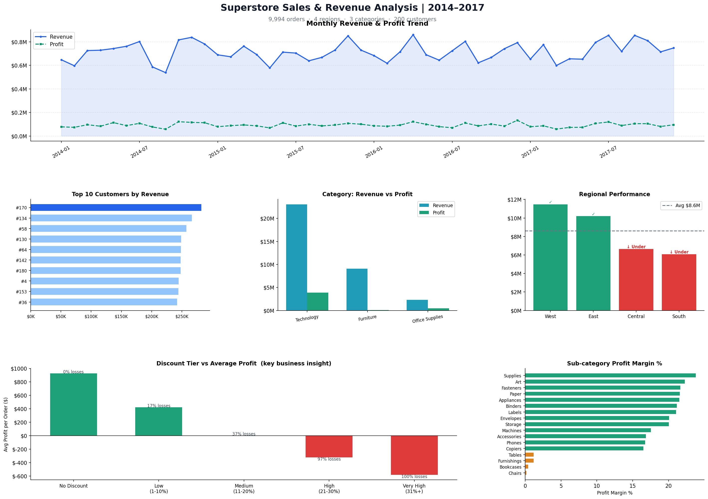

# sales-analysis
# Superstore Sales & Revenue Analysis

**Tools:** Python, Pandas, Matplotlib, SQL (MySQL)  
**Dataset:** 9,994 orders | 4 regions | 3 categories | 2014–2017

## Objective
Analyze sales performance across regions, categories, and customers
to identify revenue drivers, underperforming segments, and the impact
of discounting on profitability.

## Key Findings
- **Central and South regions** are underperforming — both below the
  $8.6M regional revenue average, driven by 2× higher discount rates
  vs West and East
- **Discount-profit relationship:** Orders with 30%+ discounts have a
  97–100% loss rate — every high-discount order loses money
- **Furniture** has only 0.73% profit margin despite being the 2nd
  highest revenue category — a hidden profitability risk
- **Top 10 customers** contribute ~12% of total revenue with
  consistently higher margins than average

## SQL Queries Cover
- Monthly revenue trend with profit margin %
- Top 10 customers by revenue (using JOINs)
- Category-wise performance with margin tiers (CASE statements)
- Regional underperformer identification (subquery benchmark)
- Discount vs profit analysis (GROUP BY + CASE)
- Year-over-year growth using window functions (LAG)

## Dashboard Preview


## Files
| File | Description |
|------|-------------|
| `superstore_sales.csv` | Cleaned dataset (9,994 rows) |
| `superstore_python_analysis.py` | Full Python + Pandas analysis |
| `superstore_sql_analysis.sql` | 8 SQL queries with comments |
| `superstore_analysis.png` | 6-chart visual dashboard |

## How to Run
```bash
pip install pandas matplotlib numpy
python superstore_python_analysis.py
```
